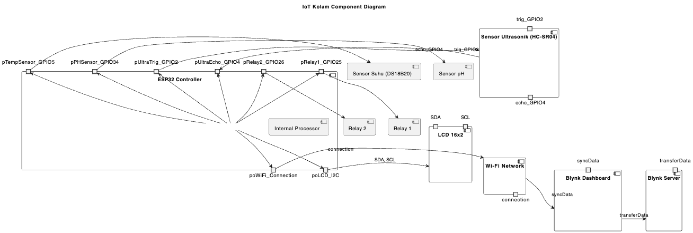

# Proyek IoT untuk Kolam dengan ESP32

## Gambaran Umum
Proyek ini menunjukkan sistem IoT untuk kolam menggunakan board ESP32 DEV Module. Sistem ini mengintegrasikan berbagai sensor dan modul untuk memantau dan mengontrol parameter lingkungan kolam. Proyek ini menggunakan Arduino IDE untuk pengembangan dan memanfaatkan beberapa library untuk meningkatkan fungsionalitas.

## Fitur
- **Integrasi Wi-Fi dan Blynk**: Memantau dan mengontrol sistem dari jarak jauh.
- **Pengukuran Suhu**: Sensor suhu Dallas untuk mengukur suhu air kolam.
- **Pengukuran Jarak Ultrasonik**: Mengukur kedalaman air menggunakan sensor ultrasonik.
- **Integrasi Sensor pH**: Membaca level pH untuk memantau kualitas air kolam.
- **Layar LCD**: Menampilkan data secara real-time.
- **Kontrol Relay**: Mengelola perangkat yang terhubung berdasarkan input sensor.

## Kebutuhan
- **Perangkat Keras**:
  - ESP32 DEV Module
  - Sensor Ultrasonik (misalnya HC-SR04)
  - Sensor Suhu Dallas
  - Sensor pH
  - Modul Relay
  - LCD 16x2 dengan Modul I2C
- **Perangkat Lunak**:
  - Arduino IDE
  - Library yang diperlukan (install melalui Arduino Library Manager):
    - `BlynkESP32_BT_WF`
    - `DallasTemperature`
    - `LiquidCrystal_I2C`
    - `NewPing`
    - `OneWire`

## Pengaturan Arduino IDE
1. Install Arduino IDE.
2. Tambahkan URL board ESP32 ke dalam Preferensi Arduino IDE:
   - Buka `File > Preferences`
   - Tambahkan URL berikut ke "Additional Board Manager URLs":
     ```
     https://dl.espressif.com/dl/package_esp32_index.json
     ```
3. Install paket board ESP32 melalui "Boards Manager".
4. Pilih pengaturan berikut:
   - Board: `ESP32 Dev Module`
   - Kecepatan Upload: `115200`
5. Install library yang diperlukan melalui "Library Manager".

## Diagram Koneksi
Diagram koneksi untuk sistem ini dijelaskan di bawah ini. Diagram PlantUML menggambarkan hubungan antara komponen.

```plantuml
@startuml
actor Pengguna
package ESP32 {
  component ESP32 as E
  node SensorUltrasonik as USensor
  node SensorSuhuDallas as TempSensor
  node Sensor_pH
  node ModulRelay
  node LCD as ModulLCD
}

E -[-> USensor : TrigPin (GPIO2), EchoPin (GPIO4)
E -[-> TempSensor : GPIO5 (OneWire)
E -[-> Sensor_pH : PH_SENSOR_PIN (GPIO34)
E -[-> ModulRelay : RELAY1_PIN (GPIO25), RELAY2_PIN (GPIO26)
E -[-> ModulLCD : SDA, SCL (I2C)
@enduml
```



## Konfigurasi Kode
### Kredensial Wi-Fi
Ganti placeholder di kode dengan kredensial Wi-Fi Anda:
```cpp
const char* ssid = "SSID_Anda";
const char* pass = "PASSWORD_Anda";
```

### Token Autentikasi Blynk
Ganti `BLYNK_AUTH_TOKEN` dengan token Anda:
```cpp
#define BLYNK_AUTH_TOKEN "Token_Autentikasi_Blynk_Anda"
```

## Proses Upload Kode
1. Sambungkan board ESP32 ke komputer Anda.
2. Buka Arduino IDE.
3. Muat kode yang telah disediakan.
4. Pilih board dan port yang sesuai.
5. Klik "Upload" untuk mengunggah kode.

## Cara Kerja
1. **Inisialisasi**:
   - Menginisialisasi sensor, LCD, dan koneksi Blynk.
   - Menampilkan pesan selamat datang di LCD.
2. **Loop**:
   - Membaca jarak, suhu, dan level pH.
   - Menampilkan data di LCD dan mengirimkannya ke aplikasi Blynk.
   - Mengaktifkan relay berdasarkan kondisi (misalnya, kedalaman air tinggi).
   - Mengirim notifikasi untuk kondisi abnormal.

## Contoh Output
- **Serial Monitor**:
  ```
  System Initializing...
  Stem Displacement: 150 mm
  25.00°C
  77.00°F
  pH Level: 7.2
  System Initialized
  ```
- **Layar LCD**:
  ```
  DIST
  150
  ```
- **Aplikasi Blynk**:
  - Melihat data sensor secara real-time.
  - Menerima peringatan untuk suhu dan level pH yang abnormal.

## Pemecahan Masalah
- Pastikan semua koneksi sudah benar.
- Verifikasi kredensial Wi-Fi dan token Blynk.
- Periksa monitor serial untuk pesan kesalahan.
- Pastikan library terinstal dengan benar.

